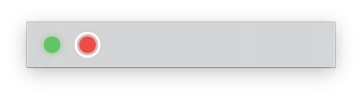

# cmux-led



Floating macOS overlay. One LED per tab in your current [cmux](https://cmux.com) workspace.

- 🟢 idle — Claude waiting on you
- 🔴 busy — Claude working
- white ring — focused tab
- click LED → focus that tab in cmux

## Install

```bash
brew tap rollsrice/cmux-led
brew install --cask cmux-led
./setup-cmux.sh && osascript -e 'tell application "cmux" to quit' && open -a cmux
```

`setup-cmux.sh` (in this repo) flips `automation.socketControlMode` to `allowAll` in `~/.config/cmux/cmux.json`. Without it cmux refuses external control. Original config is backed up.

> Security: `allowAll` lets any local process drive cmux (read panes, inject keystrokes). Don't enable on shared machines.

## Build

```bash
swift run                # dev
VERSION=0.1.0 ./build-app.sh   # release zip + sha256 for cask
```

## License

MIT
